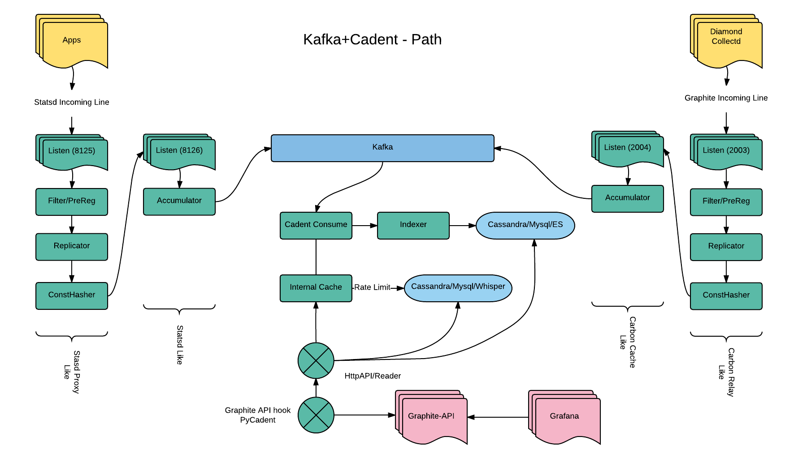
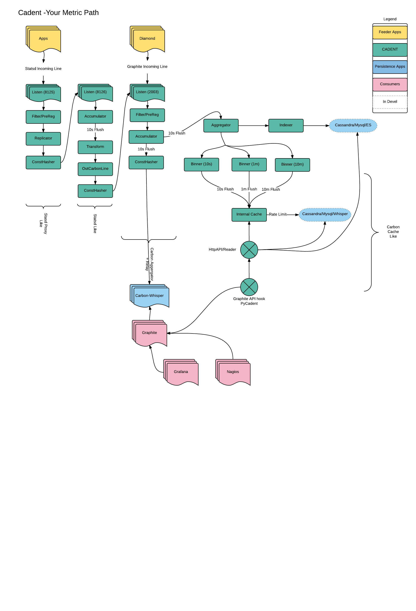

Cadent
======

Manipulate your metrics

### The Name:

is "k-dent" as in "`k` as in `cake`" `\ˈkā-dənt\` ..
call it "ca-dent" (`ca` as in `cat`) if you really want to .. but that holds no real meaning (just look it up)

### Function

Basically this acts like many tens of existing projects out in the wilderness that either are, or act like,
the standard "set": statsd, statsd-proxy, carbon-relay, carbon-aggegator, carbon-cache.

It "sorta" behaves like carbon-cache, (as it can read/write to whisper files but does not have the "entire functionality set" of carbon-cache)
Cassandra, and even a SQL DB if you really think that's a good idea, watch as you kill your RDBS trying to insert 100k items in 1 second)

But dramatically retooled and optimized to handle 100's of thousands of metrics a second.

Has a pipeline feel but optimized for what we really need

 - consistent hashing relay: statsd proxy, carbon-relay
 - metric filter and router
 - relay replication
 - accumulation and aggregation: statsd, graphite
 - time series writing: gorilla, protobuf, msgpack, etc
 - metric indexing: (memory, elastic, leveldb, etc)
 - api endpoints: grpc, tcp, http(s)

Yes "each" of the above can be handled by a standalone app (and many do exist in the echo system) .. however at the volume
we want to address .. there's nothing like raw RAM/CPU power on a local node (the internet, slow, ram, fast).

Note:: configuration for complex scenarios of loop backs, replicas moving, multiple backends, accumulators, and aggregators
can get confusing .. and you can find yourself hitting yourself over the head alot.  You's say "why not keep it simple"
If metrics collection and manipulating was simple, I would not have to write this.

Installation
------------

Well, first you need to install go .. https://golang.org  >= 1.5.1
And a kernel that supports SO_REUSEPORT (linux 3.9 or higher and bsd like kernels)
And make sure to use VENDOR support (in golang 1.6, this is the default),

go 1.9.x is preferred as it's better, faster, stronger.

    git clone https://github.com/wyndhblb/cadent
    cd cadent
    export GOPATH=$(pwd)
    make

## Some Docs

Enough chatter, dive into the sub documents.

 - [Incoming line formats](./docs/lineformats.md) - Currently supported incoming "line" formats
 - [Consistent Hashing + Line Protocal Servers](./docs/hashers.md)
 - [OS tuning for Consistent Hashing](./docs/os-tune.md)
 - [TimeSeries](./docs/timeseries.md) - There is lots of experimenting, series types and use cases provided here
 - [Writing metrics](./docs/writers.md) - Here you will find the schemas, some gotchas, advice and what nots.
 - [UniqueID generation](./docs/uniqueid.md) - Notes on how cadent determins a "unique" id for each metric
 - [Configuration](./docs/config.md) - There are many options, many settings.  Hopefully this will help with their meanings
 - [Injectors (aka Kafka)](./docs/injectors.md) - Best practices for hooking kafka into the series mechanism
 - [Clustering](./docs/cluster.md) - api clustering
 - [HTTP API](./docs/api.md) - HTTP API for querying (for graphite, graphite-api, raw and other things)
 - [TCP Api](./docs/tcpapi.md) - A very simple, Redis inspired, TCP API
 - [Dev and Test](./docs/dev.md) - Some handy notes when developing. 

## Supported Backends

## Table of implemented apis and writers

Not everything can implement the APIs/Stoarge due to their database nature. 
Below is a table of what drivers implement which endpoints

### Metrics

| Driver   | /rawrender + /metrics | /cache  |
|---|---|---|
| cassandra-log | Yes  | Yes | 
| cassandra | Yes | Yes | 
| cassandra-flat | Yes  | n/a |
| cassandra-flat-map | Yes  | n/a | 
| elasticsearch-flat | Yes  | No  |  
| elasticsearch-flat-map | Yes  | No  | 
| mysql | Yes  | Yes |
| mysql-flat | Yes  | n/a | 
| redis-flat-map | Yes  | n/a | 
| kafka | n/a  | Yes | n/a |
| kafka-flat | n/a  | n/a | 
| levelDB | No  | No | 
| file | n/a | n/a  |
| whisper| yes | n/a | 
| echo | n/a | n/a | 

### Index

| Driver   |  /expand | /find  | TagSupport |
|---|---|---|---|
| cassandra | Yes | Yes | No |
| mysql | Yes  | Yes  |  Yes (not good for ALOT of tags) |
| elasticsearch | Yes  | Yes  |  Yes  |
| kafka | n/a  | n/a | n/a |
| levelDB | Yes  | Yes | No |
| whisper | yes | yes | n/a |
| ram | yes | yes | No |
| noop | n/a | n/a | n/a |

`n/a` means it cannot/won't be implemented

`No` means it has not been implemented yet, but can

`TagSupport` is forth coming, but it will basically add an extra Query param `tag=XXX` to things once the indexing has been hashed out
 It should also be able to follow the "prometheus" query model `?q=my_stat{name1=val, name2=val}`
 
`flat` means metrics are stored as `time: value` pairs (in some form) rather then binary compressed forms
 
`map` means metrics are stored in a `map` like data structure using timeslabs (https://github.com/wyndhblb/timeslab) formats as primary keys along with the metric ID

`cache` caches are necessary for binary compressed formats to reside in RAM before writing.  Thus only those writers that use
these formats have the ability to "query" the cache directly.

Examples Configs
----------------

Look to the [configs directory](./configs/) for all the options you can set and their meaning

### Statsd replacement:

To start, let's replace the statsd because there are too many UDP errors

    cadent --config=configs/statsd/statsd-config.toml

### Carbon-relay replacement

then you notice carbon-relay basically not being to keep up w/ both server (diamond/collectd) and statsd

    cadent --config=configs/graphite/graphite-config.toml

### Stat filtering

then you notice that kafka/cassandra is spewing forth many metrics, and that 90% of basically useless.
(and do you really need metrics from elasticsearches ".marvel*" indexes (per day)?)

    cadent --config=configs/statsd/statsd-config.toml --prereg=configs/statsd/statsd-relay-graphite.toml

### Carbon-Cache replacement 

then you notice, that carbon-cache is backing up (and consuming so much RAM) becuase writing to EBS volumes puts you in
IOWait hell) that restarting (nicely) it is basically impossible.

    cadent --config=configs/graphite/graphite-config.toml --prereg=configs/graphite/graphite-whisper-flat.toml

### Both statsd+graphite at the same time

Or wait, this is really just a test environment, or a dev env, where no one really would be woken up if the metrics
stoped flowing (i.e. pinned to one instance).  So put the entire package on one machine.

    cadent --config=configs/multi/statsd-graphite.toml --prereg=configs/multi/statsd-graphite-prereg.toml

### statsd+graphite to cassandra

Ah, but then there's the storage issue.  Disks suck, disks suck even more if they go down and all your data is gone.
system metrics wait for no one.  Well there cassandra, which helps with that.  But you need to be able to
backfill the cassandra DB while things "continue on as normal", So you may need to run "both" for a while until
cassandra can get the all-clear.

    cadent --config=configs/multi/statsd-graphite.toml --prereg=configs/multi/statsd-graphite-multi.toml

### Local machine statsd+graphite - leveldb

You just want to put stats to your localhost, store things locally in a disk and memory efficient manner, and expose
an api endpoint one can request.

    cadent --config=configs/multi/statsd-graphite.toml --prereg=configs/graphite/graphite-leveldb-log-series.toml
 
### Just Echo to Stdout what would be written

A simple local server that will simply echo to stdout the stats that would otherwise be going somwhere

    cadent --config=configs/statsd/statsd-echo-config.toml  --prereg=configs/statsd/statsd-echo-graphite.toml --loglevel=critical
 

The story continues.

  1. cardinality (i.e. the sheer number of keys) explodes :: elasticsearch can help with that.
  2. I need to farm these things to "somewhere else" :: kafka helps with that
  3. I have tags :: ok what's the big deal? (i.e. my.stat.is.good == {pronoun=my, noun=stat, verb=is, adjective=good} but in way fewer chars)
  4. I'm really just locally/small dev env messing with things :: ok

Hopefully, cadent can help w/ alot of those scenarios.

Basically there are so many use cases, and so many solutions, with so many variations, requirements, cost restrictions, etc
there is no magic bullet.  If you can afford the cost (not just machines, but the people)
to actually set up a proper full sized Kafka + Druid + Spark + Hadoop
cluster(s) (and all of their fun "extras" that they need), then by all, means please, use those.

### So what is "prereg"?

This does many things optionally

    1. Lets one pre-route lines to various backends (as defined in the --config file)
    2. Reject incoming lines based on the key name
    3. Accumulates stats into time buckets (i.e. like statsd, but for any metric)
    4. Fowards those accumulated lines back into other backends and/or
    5. Writes index to indexer backends
    6. Writes metrics to metric backends
    7. Defines API endpoints

    cadent  --config=configs/graphite/graphite-config.toml --prereg=configs/graphite/graphite-cassandra-series.toml

To get started there is a docker-compose.yml prepared to fire up any writer backend you wish.

What Cadent does
----------------

Current Flow ::

The Flow of a given line looks like so

    InLine(s) -> Listener -> Splitter -> [Accumulator] -> [PreReg/Filter] -> Backend -> Hasher -> OutPool -> Buffer -> outLine(s)
                                              |                 |              [ |  -> Writer/Indexer ]
                                              |                 |
                                              |                 |[ -> Replicator -> Hasher -> OutPool -> Buffer -> outLine(s) -> [Writer/Indexer] ]
                                              |-> [ Writer/indexer ]
Things in `[]` are optional

### What cadent does not do.

Visualization: In the visualization world grafana wins, period, we're not visualizing things in cadent.

`result = f(timeseries)`: Graphite/graphite-api also win here (or even the spark DSL), by alot.
Their DSL for applying `fancy math` to timeseries is near impossible to match (not impossible, but really hard to
recreate it as it's depth is rather mystifying sometimes).

## Why is it designed this way?

Well, no system lives in a vacuum.  You probably already have a graphite cluster, maybe OpenTSDB, or what-have-you, and
need to migrate systems as whatever you are using is falling down. But you cannot
just "cut the cord" to the old system as there are many dependencies on it already.  System time series never stop, never slow
down, never go away, they keep increasing. So each peice of this puzzle is made to partially replace another.
If one element cannot be "out of the box"
replaced, then replication to a new system is there to feed things to the old one, while bootstrapping the new one.

That's why this looks a bit like plaster covering a few holes left by a few baseballs.  You can only cover one hole
at a time.

## What is an Accumulators?

Basically the same thing as `Statsd` and `Carbon Aggregator`.

Accumulators almost always need to have the same "key" incoming.  Since you don't want the same stat key accumulated
in different places, which would lead to bad sums, means, etc.  Thus to use accumulators effectively in a multi server
endpoint scenario, you'd want to consistently hash from the incoming line stream to ANOTHER set of listeners that are the 
backend accumulators (in the same fashion that Statsd Proxy -> Statsd and Carbon Relay -> Carbon Aggregator).  

It's easy to do this in one "instance" of this cadent where one creates a "loop back" to itself, but on a different
listener port.

     InLine(port 8125) -> Splitter -> [PreReg/Filter] -> Backend -> Hasher -> OutPool (port 8126)
        
        --> InLine(port 8126) -> Splitter -> [Accumulator] -> [PreReg/Filter] -> Backend -> OutPool (port Other)

This way any farm of hashing servers will properly send the same stat to the same place for proper accumulation.

### Time 

A finicky thing.  So it's best to have NTP running on all the nodes.  

Resolutions have been tested to the Seconds scale only.  Under very heavy loads, anything else requires too much money 
to actually run.

I don't claim nanosecond proper timescales yet this requires much more syncro of clocks between hasher nodes then
this currently has, but milliseconds should work so long as NTP is doing it's job.

For protocals that don't support a "time" in their line protocal (statsd), time is "NOW" whenever time is needed.
(i.e. a statsd incoming to graphite outgoing). 

For those that do (graphite), time will be propagated from whatever the incoming time is.  Since things are "binned"
by some flush/aggregation time, any incoming will be rounded to fit the nearest flush time and aggregated in that
bin.  The Binning is effectively the nearest `time % resolution` (https://golang.org/pkg/time/#Time.Truncate)

#### Regex/log relay Digression

For Regex lines, you can specify the `Timestamp` key for the regex (if available) same as the `Key`. i.e
 
    `^(<\d+>)?(?P<Timestamp>[A-Z][a-z]+\s+\d+\s\d+:\d+:\d+) (?P<Key>\S+) (?P<Logger>\S+):(.*)`

To use it properly you will need to specify a `timeLayout` in the regex options, of the golang variety
(see: https://golang.org/src/time/format.go .. note that the timeLayout should be a string example like shown
"Mon Jan 02 15:04:05 2006")

Time really only matters for sending things to writer backends or another service that uses that time.

#### Flat writer note:

*Please note::* certain backends (i.e. cassandra-flat, mysql-flat, etc) will "squish" old data points if times are sent in
funny order.  Meaning if you send data with times 1pm, 1pm, 1pm in one "flush period" then all the 3 of those "1pm times"
will get aggregated and inserted in the DB.  However, if one tries to "re-add" the 1pm data sometime in the future 
this will clobber the old data point with the new data.  Meaning that we don't aggregate the old value w/ a new one
as this particular process is _very_ expensive (select if exists, merge, update) vs just upsert.  When attempting
to write 200k/points sec, every milliseconds counts.  If this is something that's a requirement for you, please let
me know and i can try to make it a writer option, but not as the default.  

#### Differences from the carbon-cache and time

Unlike the generic `graphite` data format, which can have different time retentions and bin sizes for different metrics
I have taken the approach that all metrics will have the same bin size(s).  Meaning that all metrics will get 
binned into `times` buckets that are the same (you can have as many as you wish) and to keep the math simple and fast
the timer buckets should be multiples of each other, for instance.

    times = ["5s", "1m", "10m"] 
    
OR w/ TTLs (note must be in "hours/min/seconds" not days/months)

    times = ["5s:168h", "1m:720h", "10m:17520h"] 
    
This also means the "writers" below will need to follow suit with their data stores and TTLs,  Things like MySQL and files
have no inherent TTLs so the TTLs are not relevant and are ignored, Cassandra, on the other hand, can have these TTLs per item. Also
TTLs are outed as "time from now when i should be removed", not a flat number.  

THe "base" accumulator item will constantly Flush stats based on the first time given (above every `5s`). It is then Aggregators
caches to maintain the other bins (from the base flush time) and flush to writers at the appropriate times. 

_MULTIPLE TIMES ONLY MATTER IF THERE ARE WRITERS._

What Needs Work
---------------

Of course there are always things to work on here to improve the world below is a list that over time i think should be done

1. Bytes vs Strings: strings are "readonly" in go-land and we do alot of string manipulation that should be memory improved by using []bytes instead.
Currently much of the system uses strings as it's basis for things, which was a good choice initially (as all the stats/graphite
lines are strings in the incoming) but at large loads this can lead to RAM and GC issues.  I'm pretty sure some re-working things into byte slices will yield much goodness.

2. OverFlow handling: If you have millions of metric keys and many millions of metric points per second .. use a kafka bus

3. Metric Indexing (Tag indexing): Graphite's "format" was made for file glob patterns, which is good if everything is on a file system
this is not the case for other data stores.  And introducing a "tag/multi-dim" structure on top of this just makes
indexing that much harder of a problem to be able to "find" metrics you are looking for (obviously if you know the exact
name for things, this is easy, and some TSDBs do indeed force this issue), but we are spoiled by the graphite's finder abilities.

4. Clustering/Internal messaging.  The current hashing mechanism is "dumb" in that it does not know about any external
cadents running that may be the accumulator portion (which cannot be assumed as we may be dumping to something totally different)
But if it is a "cadent->cadent" transfer there are much better/faster mechanisms to get data across a wire then converting things
back to strings and starting the entire process over again.

5. "shutdown" currently pretty clunky and can lead to some crash fail modes (i.e. writing to a closed channel sort of stuff) as the pipeline
can sometimes be difficult to fully "shutdown-in-order" as there are many disjoint queues and dispatch mechanism.  It has improved, but still
random panics can occur under very large loads.

6. Lastly, writer/reader tests.  Mocking all the DBs needed in the mix currently is no easy feet (that's an entire code base in itself)
Many of the sub components have a decent test-suit just not the full "writer/reader" mechanisms.

    
Fancy Flow Diagrams
-------------------

### Kafka

### Non-Kafka

Author
------
bo blanton
